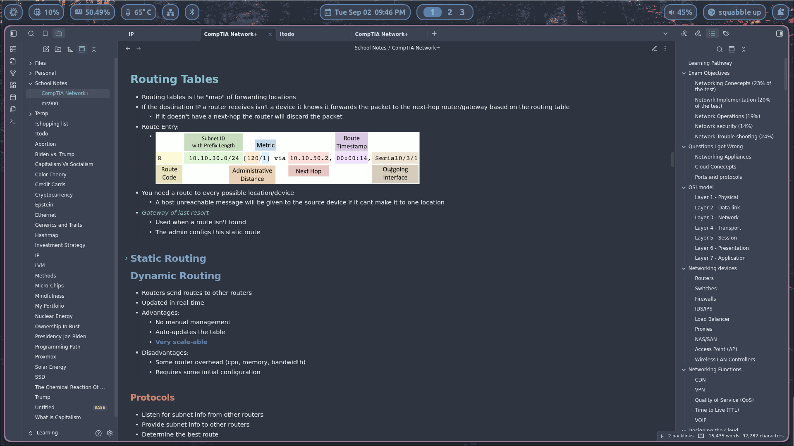
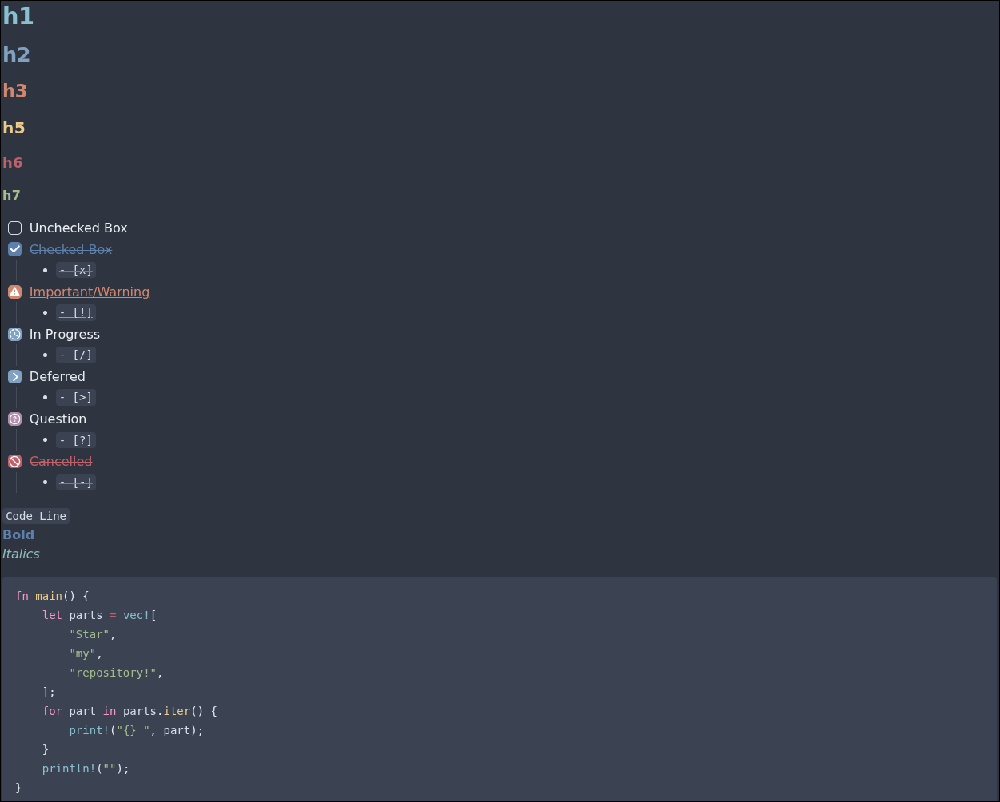

An enhanced [Nord](https://github.com/arcticicestudio/nord) theme for [Obsidian](https://obsidian.md), based on [Insanum's original work](https://github.com/insanum/obsidian_nord).

# Whats Different In This Fork?

- Added button colors
- Added different checkbox styles
- Changed the heading colors
- Changed link colors
- Changed the bold and italics colors
- Removed the light theme (will be added back later)
- And more smaller tweaks

# Preview

# If you use this theme leave a star :)
